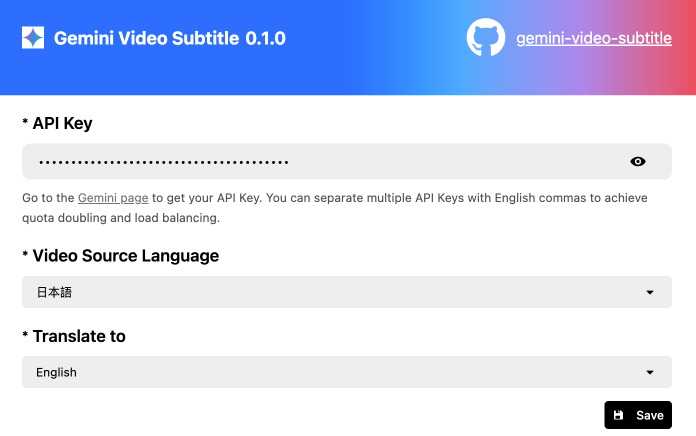

<picture>
  <source media="(prefers-color-scheme: dark)" srcset="./public/gemini-video-subtitle.png">
  
</picture>

    <em>Realtime transcription of videos in any language on any web page – powered by Gemini Multimodal.</em>

  

  <!-- TypeScript Badge -->
  

  

# Features
- Real-time transcription and translation of videos in any language.
- Works seamlessly on any web page.
- Powered by Gemini Multimodal, ensuring high accuracy and speed.

# Examples
## 1.English to Chinese

  

## 2.Japanese to English

  

# Getting Started
## Step1: Obtain a Gemini API Key
To use this extension, you need a Gemini API key. You can apply for one [here](https://aistudio.google.com/apikey)
## Step2: Configure the API Key
Once you have your key, configure it within the extension to enable real-time transcription and translation.

  

# Notes
- A Gemini API Key is required to access all features. Ensure it is correctly set up in the configuration panel.
- This extension is designed to provide smooth and accurate transcription for any language and web video.

Feel free to open an issue for questions, feedback, or suggestions. We are here to help!