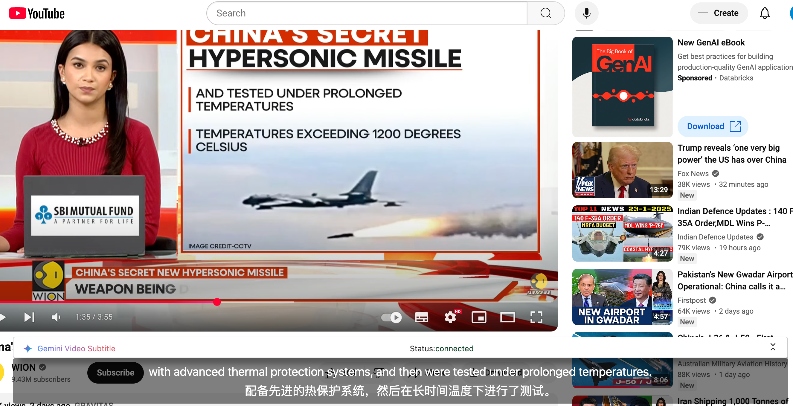
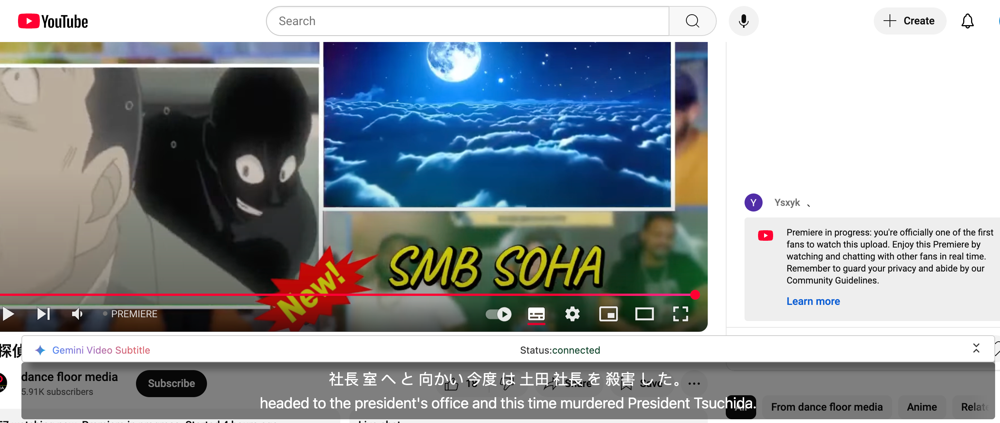

<picture>
  <source media="(prefers-color-scheme: dark)" srcset="./public/gemini-video-subtitle.png">
  
</picture>

    <em>Realtime transcription of videos in any language on any web page – powered by Gemini Multimodal.</em>

  

  <!-- TypeScript Badge -->
  

  

# Showcase
## 1.English to Chinese

## 2.Japanese to English

## Japanese to English
